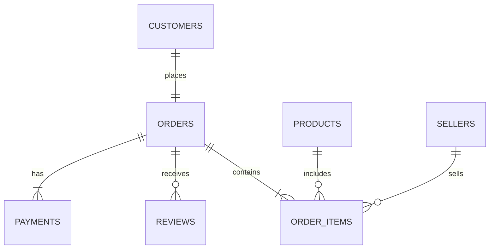

# Design Document

By HIEN NGUYEN

Video overview: https://youtu.be/cB2C6S0mEDA 

## Scope

* Purpose:
This database models Olist, a Brazilian e-commerce marketplace, capturing the core entities and transactions needed to analyze business performance across customers,
sellers, and products. The purpose is to enable retrieval and analysis of real-world marketplace data, tracking who buys, sells, what's sold, and how transactions unfold in order to answer business-relevant questions such as which sellers generate the most revenue, which product categories are most popular, and how customer satisfaction varies across sellers.

* Included within the scope of the database are:
- Customers, including their unique identifiers and geographic location (city, state, zip code)
- Sellers, including their geographic location
- Products, including their unique identifiers, category, informations
- Orders, including their unique identifiers, status, key timestamp
- Order items, which are the individual products within an order, including their price, seller
- Payments, including payment type, value of the payment
- Reviews, including the feedback, experience, rate from customers for sellers and their products, timestamp

* Beyond the scope of the database are elements not present in the underlying Olist dataset, such as inventory/stock levels, return and refund processing, shipping carrier details, and marketing or advertising data.

## Functional Requirements

* Users of this database should be able to look up sales performance and business metrics, such as top-performing sellers, best-selling pproduct categories, average order values by region, and customer satisfaction trends via reviews. Users should also be able to add new records, as the business operates (inserting new orders as customers make purchases), update existing records as circumstances change updating an order's status as it ships, is delivered, or is canceled).

* Beyond the scope of what a user should be able to do with this database: it does not support real-time inventory management, the actual processing of payments, or user authentication and login fuctionality. This database is designed for analysis and record-keeping of transactions that have already occurred, not for powering a live, transactional e-commerce platform in real time.

## Representation

### Entities

Customers:
The customers table stores customer records, including customer_id, customer_unique_id, and location (customer_zip_code_prefix, customer_city, customer_state). IDs use TEXT since they are alphanumeric, not numeric values meant for math. Most columns are NOT NULL, since this information is essential to identify and locate a customer. customer_id serves as the primary key rather than customer_unique_id, since Olist generates a new customer_id per order, making it unique per row, while customer_unique_id persists across a customer's orders and is kept as a regular column to suppoer repeat-customer analysis.

Sellers:
The sellers table stores seller records, with attributes seller_id and location (seller_zip_code_prefix, seller_city, seller_state). seller_id uses TEXT for the same reason as customer_id, it is an alphanumeric string, not a numeric value. seller_zip_code_prefix is stored as INTEGER, and city/state as TEXT. All columns are NOT NULL, since this information is essential to identify and locate a seller. Unlike customers, seller_id is unique per seller (not regenerated per transaction), making it a straightforward choice for the primary key.

Products:
The products table stores product records, with attributes including product_id, product_category_name, and physical/descriptive attributes: product_name_lenght, product_description_lenght, product_photos_qty, product_weight_g, and dimensions (product_length_cm, product_height_cm, product_width_cm). product_id uses TEXT because it is alphanumeric, not numeric. THe reamaining attributes are INTEGER, since they represent whole_number counts and measurements. All columns are NOT NULL, since this information provides essential context about each product which are category, dimensions, and descriptive detail that would otherwise leave a product record incomplete.

Orders:
The orders table stores order records, with attributes order_id, customer_id, order_status, and timestamps tracking the order lifecycle (order_purchase_timestamp, order_approved_at, order_delivered_carrier_date, order_delivered_customer_date, order_estimated_delivery_date). IDs and timestamps use TEXT, since timestamps are stored as ISO 8601 date strings. Core fieds are NOT NULL, but order_approved_at and the delivery dates are nullable, since an order in progress hasn't necessarily reached those stages yet.

Order items:
The order_items table represents individual products within an order, with attributes order_id, order_item_id, product_id, seller_id, shipping_limit_date, price, and freight_value. Since order_item_id restarts at 1 for each order, the combination of order_id and order_item_id forms a composite primary key. price and freight_value use REAL to allow decimal values.

Payments:
The payments table records payment transactions, with attributes order_id, payment_sequential, payment_type, payment_installments, and payment_value. Since an order can be split across multiple payments, order_id and payment_sequential together form a composite primary key. All columns are NOT NULL, since an incomplete payment record would be meaningless.

Reviews:
The reviews table stores customer reviews, with attributes review_id, order_id, review_score, review_comment_title, review_comment_message, review_creation_date, and review_answer_timestamp. review_id alone is the primary key, since each review is independently identifiable. review_comment_title and review_comment_message are nullable, since many customers leave a score without a written comment.

### Relationships

The diagram above illustrates the relationships between entities in the database. Starting with customers and orders, this is a one-to-one relationship, since an order can only be placed by one customer. Although a customer can place many orders overall, each row in the customers table represents a single order's worth of customer information, since Olist generates a new customer_id for every order rather than reusing one identifier per person. As a result, each customer_id attaches to only one order. Repeat-customer behavior can still be tracked separately using customer_unique_id, which persists across a customer's multiple orders.

Orders has three relationships with three other tables. The first is with payments. Orders and payments have a one-to-many relationship, since an order can be paid for using multiple payment transactions (for example, part gift card and part credit card), but each individual payment transaction belongs to only one order. Even if the same card is reused across different orders, each use creates a separate transaction row tied to just that one order.

The second is orders and reviews, which also have a one-to-many relationship. An order can receive zero or many reviews, since a customer can choose to leave no review, or review individual items within that order separately. The last relationship is a one-to-many relationship between orders and order items: an order can contain one or many items, but each item belongs to only one order.

Products and order items have a one-to-many relationship. One product, such as a specific listing in the catalog, can appear in many order items if it's purchased multiple times, but each order item points to exactly one specific product.

Sellers and order items have a one-to-many relationship. A seller can sell zero or many items, but an item can only be sold by one seller.

## Optimizations

For this database, I created 4 indexes, which can improve efficiency and save time. These indexes are order_items_sellers_id, orders_customer_id, products_product_category_name, and review_order_id. When I ran EXPLAIN QUERY PLAN on queries such as finding the top 10 sellers by revenue, the 5 sellers with the best and worst average review scores, and the 50 most frequent repeat customers, I checked whether SQLite was using SEARCH or SCAN on each table. A SCAN means SQLite checks every row in a table to find matches, which takes more time, especially on large tables like order_items (over 112,000 rows) and orders (nearly 100,000 rows). I created indexes on the columns responsible for these scans, which changed them to SEARCH (or a faster SCAN using a covering index), directly speeding up these queries.

I also created 2 views: top_10_product_categories and average_order_value_by_state. These represent calculations that are useful for repeated analysis, such as identifying which product categories sell best or comparing regional spending patterns, without needing to rewrite the underlying query each time.

## Limitations

There are some limitations in the design of this database. Firstly, the distinction between customer_id and customer_unique_id can be confusing to someone first looking at the schema without explanation, as it was for me. A user cannot directly query how many orders a specific customer has placed without going through customer_unique_id, since customer_id is regenerated for every order.

Secondly, in the products table, product_category_name is stored as plain text, with no constraint enforcing a fixed set of valid values. If a category name is mistyped or capitalized inconsistently (for example, "eletronicos," "Eletronicos," "electronics," and "ELETRONICOS"), SQLite treats each as a separate, distinct category rather than recognizing they refer to the same thing, leading to inaccurate results in analysis. The same limitation applies to payment_type, where inconsistent entries could similarly fragment what should be a single payment method into multiple values. This is partly a consequence of SQLite itself, which, unlike MySQL, has no built-in ENUM type to restrict a column to a predefined list of options.
